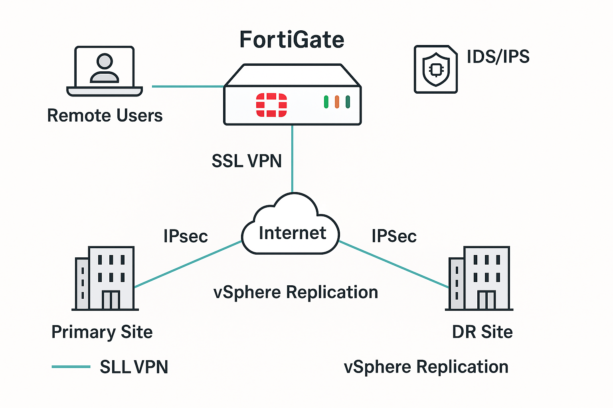
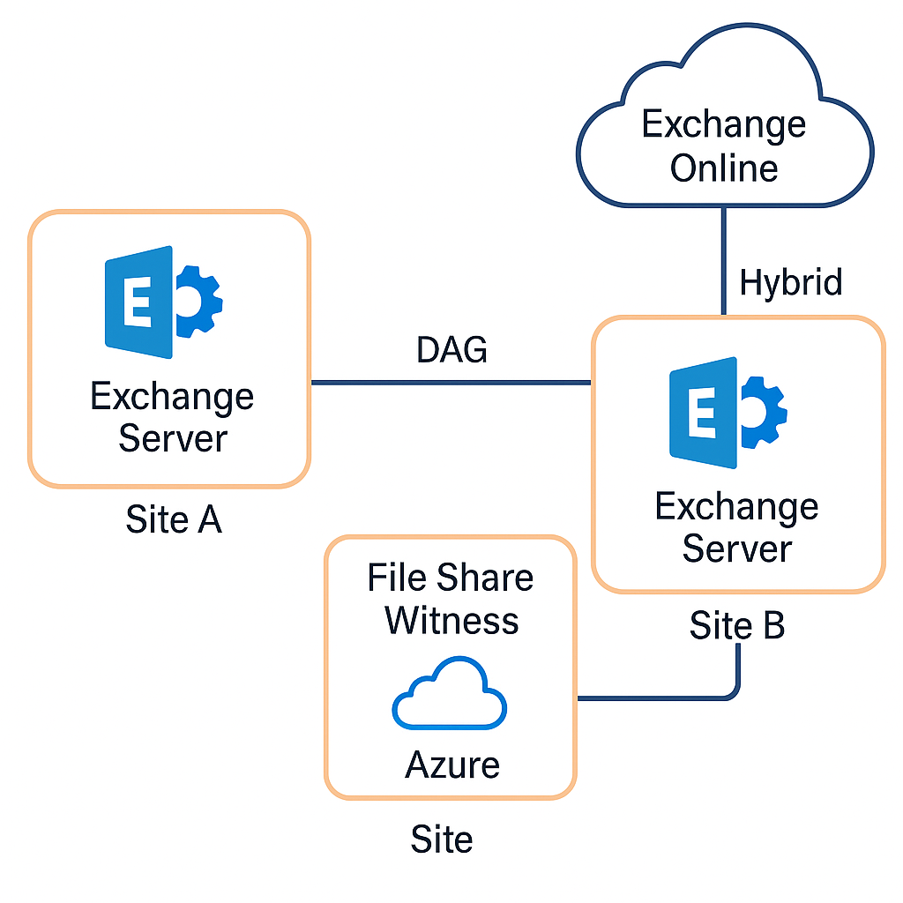
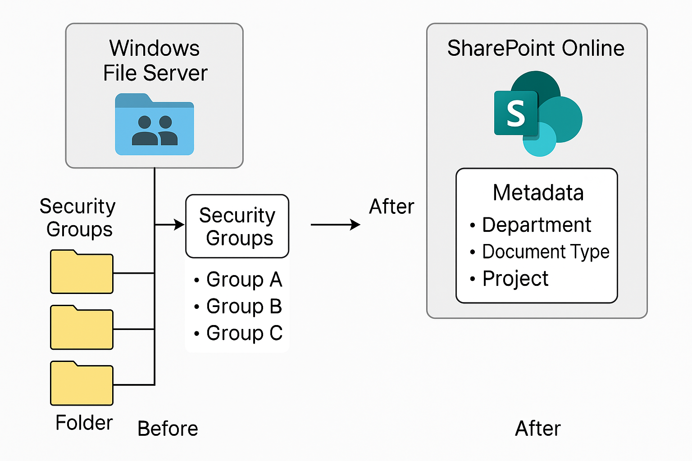

# 💼 Tendai Choruwa — Infrastructure & Cloud Portfolio

**Senior Platform & Compute Engineer | Azure | VMware | Microsoft |Linux| HPE | Cloud, DR & Security Specialist**

📍 Johannesburg, South Africa  
📧 [choruwa@outlook.com](mailto:choruwa@outlook.com)  
🔗 [LinkedIn](https://www.linkedin.com/in/tendaichoruwa/) | [GitHub](https://github.com/tendaichoruwa)

---

## 🧭 About This Portfolio

Welcome to my **Infrastructure & Cloud Engineering Portfolio** — a collection of projects showcasing how I design, secure, and automate resilient IT environments.  

With over **20 years of experience** across **mining, finance,telecoms and managed service environments**, I specialize in:
- **Hybrid Cloud & Virtualization** (Azure, VMware, Hyper-V)  
- **Platform Modernization** (Windows Server, HPE/Dell Compute, Veeam)  
- **Security & Network Optimization** (FortiGate, SonicWall, IDS/IPS, VPN)  
- **Automation & Continuity** (PowerShell, Terraform, ITIL-based DR)  

Each project below highlights my hands-on work — from infrastructure rebuilds to DR automation and high-availability configurations.

---

## 🧩 Featured Projects

### 🏢 [**IT Infrastructure Upgrade**](https://github.com/tendaichoruwa/IT-Infrastructure-Upgrade)

> **Objective:** Modernize and standardize infrastructure across multiple business units.  
> **Highlights:**  
> - Migrated legacy servers to Windows Server 2022 (Hyper-V + VMware hybrid)  
> - Upgraded compute and storage platforms (HPE 3PAR, Synology, EMC)  
> - Automated patching with SCCM & PowerShell  
> - Achieved **99.9% uptime** and **20% cost savings**  

  

---

### 🔁 [**vSphere Replication**](https://github.com/tendaichoruwa/vSphere-Replication)

> **Objective:** Ensure business continuity through real-time vSphere replication between two data centers.  
> **Highlights:**  
> - Configured replication with a **5-minute sync cycle**  
> - Automated DR testing via PowerCLI  
> - Documented DR workflows with RTO/RPO metrics  
> - **Zero data loss** and **recovery in under 45 minutes**

  

---

### 🔐 [**FortiGate IDS/IPS & VPN Optimization**](https://github.com/tendaichoruwa/FortiGate-IDS-IPS-VPN-Optimization)

> **Objective:** Redesign network security infrastructure to enhance visibility, control, and VPN reliability.  
> **Highlights:**  
> - Deployed and tuned FortiGate IDS/IPS  
> - Optimized SSL VPN with MFA  
> - Deployed IPsec tunnels for site-to-site resilience  
> - **70% reduction in intrusion attempts** and **80% fewer tickets**

  

---

### 📧 [**Exchange Server Management with High Availability**](https://github.com/tendaichoruwa/Exchange-Server-Management-HA)

> **Objective:** Deploy and manage Exchange Server 2019 DAG clusters for enterprise email reliability.  
> **Highlights:**  
> - Migrated Exchange 2010 → 2019 with zero data loss  
> - Configured 2-site DAG cluster with automatic failover  
> - Integrated hybrid Exchange Online model  
> - Maintained **99.8% uptime** across 2,000+ users  

  

---

### 🏢  [**SharePoint Online Portal Migration**](https://github.com/tendaichoruwa/SharePoint)

> **Objective:**
Create a modern SharePoint Online portal to replace legacy on-premises file servers, ensuring governance, collaboration, and data integrity.

> **Highlights:**
> - Conducted full inventory and permissions mapping from on-prem file shares.  
> - Designed **SharePoint site collections** aligned to business units (Finance, HR, Operations, Projects).  
> - Applied **Azure AD group-based access** to maintain original security posture.  
> - Introduced **metadata-based libraries** and eliminated folder sprawl.  
> - Automated document approval and retention workflows using **Power Automate**.  
> - Trained end-users and department champions to drive adoption.  
> - Established **data governance** aligned with POPIA and ISO 27001 standards.

  

---

## 🧰 Technology Stack

| Category | Technologies |
|-----------|--------------|
| **Virtualization & Compute** | VMware vSphere, Hyper-V, HPE, Dell EMC |
| **Cloud & Hybrid** | Microsoft Azure, M365, Intune, SharePoint Online |
| **Storage & Backup** | Veeam, Acronis, Datto, HPE 3PAR |
| **Security & Networking** | FortiGate, SonicWall, VPN, IDS/IPS, VLANs |
| **Automation & Tools** | PowerShell, Terraform, SCCM, IT Glue |
| **Monitoring & DR** | Zabbix, SolarWinds, ManageEngine, vSphere Replication |

---

## 🏆 Career Highlights

- Rebuilt full IT infrastructure post-ransomware in **48 hours**  
- Improved disaster recovery by **85%** (RTO <45 minutes)  
- Maintained **99.9% uptime** across multi-site operations  
- Reduced IT costs by **25%** through vendor and cloud optimization  
- Automated recurring tasks saving **120+ engineering hours/month**

---

## 📊 GitHub Stats

---

## 🌍 Connect with Me

💬 Open to opportunities in **Cloud Infrastructure**, **Platform Engineering**, and **Security Architecture**.  
📩 [Email Me](mailto:choruwa@outlook.com) | 🤝 [LinkedIn](https://www.linkedin.com/in/tendaichoruwa/)

---

> _“Every resilient system tells a story — of recovery, innovation, and disciplined engineering.”_
